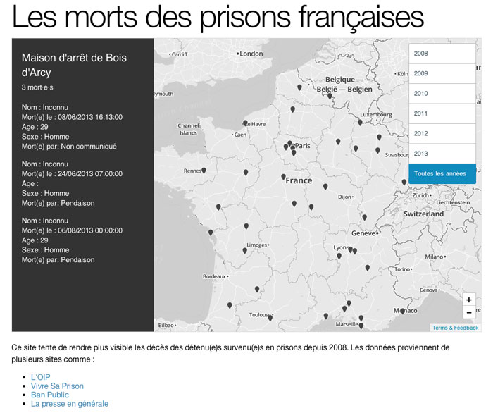

### Infos

This map use the data of :

* [Ban Public](http://prison.eu.org/spip.php?rubrique69)
* [L'OIP](http://www.oip.org/)
* [Vivre sa prison](http://vivresaprison.overblog.com/)

All the data go into a [google spreadsheet](https://docs.google.com/spreadsheet/ccc?key=0Aqv-ZGeNYxijdHFzVFVYZWJmNVhzZG9kQkxEdTB3T0E&usp=sharing) and be converted to geojson with the script below.

### Script

[The script (csv2geojson_from_google.sh)](csv2geojson_from_google.sh)download [the csv from google](https://docs.google.com/spreadsheet/ccc?key=0Aqv-ZGeNYxijdHFzVFVYZWJmNVhzZG9kQkxEdTB3T0E&usp=sharing) with curl, convert it with [csv2geojson](https://github.com/mapbox/csv2geojson) and can send it to an FTP with curl. This is a beta version.

#### ToDo

* Add datas !!!
* Working hover labels and attached to button with 'movetip' (http://www.mapbox.com/wax/movetip.html)
* Color icon linked to number of deaths or number linked. 
    
### License
Not define.

### Thanks
Thanks a lot to Mapbox team : Dane Springmeyer, Tom MacWright, AJ Ashton, and all the others !
Thanks also to Ticha 

* Map by n3b : n3b (at) riseup dot net (0x0D3E0919)
